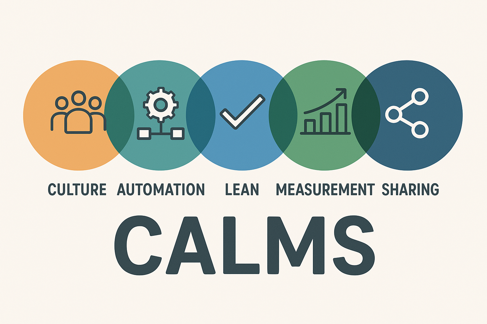

<small>Imagem gerada por IA</small>

  
  
  

## Desafio: Implementação de Práticas DevOps em um Ambiente Empresarial Fictício
Nesse desafio, você irá simular a implementação de práticas DevOps num ambiente empresarial fictício. Utilizará os conceitos de CALMS e as Três Maneiras do DevOps para identificar oportunidades para aprimorar os processos existentes e propor soluções que cultivem uma cultura de colaboração, automação e aprendizado contínuo.

## Descrição da Empresa
A Tech é uma empresa fictícia especializada em desenvolvimento de software, que oferece soluções inovadoras para clientes de diversos setores. Sua missão é simplificar a vida das pessoas através da tecnologia

### Equipe:
- Desenvolvimento: 14 desenvolvedores com experiência em Java, C# e JavaScript. Apenas um profissional tem conhecimento em Delphi, a linguagem do sistema legado.

- Operações: A equipe de operações, composta por 4 profissionais, enfrenta desafios para manter a infraestrutura de TI e os sistemas em funcionamento eficiente, frequentemente lidando com problemas de escalabilidade e desempenho.

### Projetos em andamento:
Sistema de Gestão de Vendas (LEGADO): Um aplicativo para gerenciamento de vendas que inclui controle de estoque, emissão de notas fiscais e relatórios de vendas.

Plataforma de E-commerce: uma plataforma de e-commerce escalável para clientes do setor varejista.

### Descrição dos processos atuais da empresa:
1. Entrega de Código: Após a conclusão do desenvolvimento de um novo recurso, os desenvolvedores preparam um pacote de implantação e o encaminham à equipe de operações.

2. Deploy: O deploy é realizado manualmente no ambiente de produção, sem seguir um procedimento padronizado ou utilizar automação.

3. Testes: A equipe de operações conduz testes manuais no ambiente para verificar a funcionalidade e a integridade do código após o deploy em produção.

4. Monitoramento: Após o deploy, a equipe de operações monitora manualmente o sistema de logs do servidor, para identificar problemas ou falhas que possam surgir.

### Dados de desempenho:
- Tempo médio entre a entrega do código e o deploy: 2 dias.
- Taxa de sucesso dos deploys manuais: 80%.
- Número de incidentes após o deploy: média de 2 por semana.
- Tempo médio de recuperação (MTTR) de incidentes: 4 horas.

## Resultados Esperados:
Ao final do desafio, terá elaborado um plano abrangente para implementar práticas DevOps num ambiente empresarial fictício. Este plano incluirá sugestões de automação, métricas de avaliação e estratégias para compartilhamento de conhecimento, refletindo uma compreensão prática dos conceitos teóricos apresentados neste módulo. Este desafio te preparará para aplicar esses princípios em ambientes de trabalho reais e cultivar uma cultura de colaboração e inovação.

## 🙏🏼 Agradecimentos
Quero agradecer a [Rocketseat] ( https://github.com/Rocketseat) por criar e fornecer uma base para este desafio
